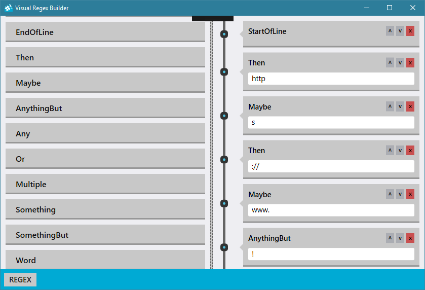

# Visual Regex Builder

## About
Visual Regex Builder is simple, ligthweight application which will 
stop all the hard work writing regular expressions by "hand". 
## Technicality
It is written in **C#** and uses **WPF** for graphic interface.

To simplify building regular expressions 
[CSharpVerbalExpressions](https://github.com/VerbalExpressions/CSharpVerbalExpressions) 
library was used.

## Regex
To build regex folowing elements are available:
- StartOfLine
- EndOfLine
- Then
- Maybe
- AnythingBut
- AnythingBut
- Or
- Multiple
- Something
- SomethingBut
- Word
- LineBreak
- Tab

## Screenshot
